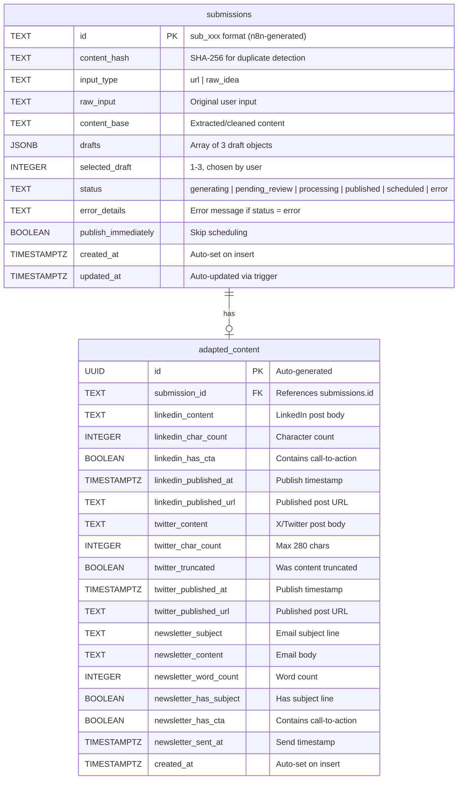

# Content Generation & Publishing Automation - Database Schema

**Author:** Ayodele Oluwafimidaraayo
**Date:** 2026-03-25
**Database:** Supabase (PostgreSQL)

---

## Overview

This schema supports a two-workflow content automation system:

1. **Workflow 1 (Content Intake & Draft Generation)** writes to the `submissions` table, storing the original input and three AI-generated article drafts.
2. **Workflow 2 (Draft Selection & Platform Adaptation)** reads the selected draft from `submissions` and writes platform-adapted content to the `adapted_content` table.
3. **React Frontend** reads from both tables via the Supabase anon key and triggers n8n webhooks for all write operations.

---

## Entity Relationship Diagram



---

## Tables

### `submissions`

Stores every content idea submitted through the system, along with three AI-generated article drafts produced by Workflow 1.

| Column | Type | Constraints | Description |
|--------|------|-------------|-------------|
| `id` | `TEXT` | `PRIMARY KEY` | n8n-generated ID in `sub_xxx` format. Text rather than UUID so n8n controls the ID namespace. |
| `content_hash` | `TEXT` | `NOT NULL` | SHA-256 hash of the normalized input. Used with `created_at` for duplicate detection within a time window. |
| `input_type` | `TEXT` | `NOT NULL`, `CHECK (url, raw_idea)` | Discriminator for how the input should be processed. URLs are fetched and extracted; raw ideas are used directly. |
| `raw_input` | `TEXT` | `NOT NULL` | The original user input exactly as submitted -- either a URL or freeform idea text. |
| `content_base` | `TEXT` | nullable | The cleaned/extracted content that was actually fed to the AI for draft generation. For URLs, this is the extracted article text. For raw ideas, this may be the same as `raw_input` or an enriched version. |
| `drafts` | `JSONB` | `DEFAULT '[]'` | Array of 3 draft objects. Each object contains: `index` (1-3), `angle` (the editorial angle), `title` (headline), `content` (full article body), `wordCount` (integer). |
| `selected_draft` | `INTEGER` | `CHECK (1-3)` | Which draft the user selected for adaptation. Set when the user picks a draft in the frontend, which triggers Workflow 2. |
| `status` | `TEXT` | `NOT NULL`, `DEFAULT 'generating'`, `CHECK (...)` | Current state in the lifecycle. See Status Machine below. |
| `error_details` | `TEXT` | nullable | Human-readable error message. Only populated when `status = 'error'`. |
| `publish_immediately` | `BOOLEAN` | `DEFAULT false` | When true, Workflow 2 publishes immediately rather than scheduling. |
| `created_at` | `TIMESTAMPTZ` | `DEFAULT NOW()` | Row creation timestamp. |
| `updated_at` | `TIMESTAMPTZ` | `DEFAULT NOW()` | Auto-updated by the `submissions_updated_at` trigger on every UPDATE. |

#### Status Machine

```
generating --> pending_review --> processing --> published
                                           \--> scheduled
                                           \--> error
generating --> error (if draft generation fails)
```

- **generating**: Workflow 1 is actively producing drafts. The frontend shows a loading state.
- **pending_review**: All 3 drafts are ready. The user can review and select one.
- **processing**: The user selected a draft and Workflow 2 is adapting it for platforms.
- **published**: All platform adaptations are complete and published.
- **scheduled**: Adaptations are complete but queued for future publication.
- **error**: Something failed. Check `error_details` for specifics.

### `adapted_content`

Stores the platform-specific adaptations of the selected draft. Created by Workflow 2 after the user selects a draft.

| Column | Type | Constraints | Description |
|--------|------|-------------|-------------|
| `id` | `UUID` | `PRIMARY KEY`, `DEFAULT gen_random_uuid()` | Auto-generated UUID. |
| `submission_id` | `TEXT` | `NOT NULL`, `REFERENCES submissions(id) ON DELETE CASCADE` | Links back to the parent submission. Cascade delete ensures cleanup. |
| `linkedin_content` | `TEXT` | nullable | Full LinkedIn post body, formatted for the platform (line breaks, hashtags, etc.). |
| `linkedin_char_count` | `INTEGER` | nullable | Character count of the LinkedIn post. |
| `linkedin_has_cta` | `BOOLEAN` | `DEFAULT false` | Whether the AI included a call-to-action in the LinkedIn post. |
| `linkedin_published_at` | `TIMESTAMPTZ` | nullable | Timestamp when the post was published to LinkedIn. NULL means not yet published. |
| `linkedin_published_url` | `TEXT` | nullable | URL of the published LinkedIn post. |
| `twitter_content` | `TEXT` | nullable | Full X/Twitter post body. |
| `twitter_char_count` | `INTEGER` | `CHECK (<= 280)` | Must not exceed 280 characters. |
| `twitter_truncated` | `BOOLEAN` | `DEFAULT false` | Whether the content was truncated to fit the character limit. |
| `twitter_published_at` | `TIMESTAMPTZ` | nullable | Timestamp when the post was published to X. |
| `twitter_published_url` | `TEXT` | nullable | URL of the published tweet. |
| `newsletter_subject` | `TEXT` | nullable | Email subject line for the newsletter. |
| `newsletter_content` | `TEXT` | nullable | Full email body content. |
| `newsletter_word_count` | `INTEGER` | nullable | Word count of the newsletter content. |
| `newsletter_has_subject` | `BOOLEAN` | `DEFAULT false` | Whether a subject line was generated. |
| `newsletter_has_cta` | `BOOLEAN` | `DEFAULT false` | Whether the newsletter includes a call-to-action. |
| `newsletter_sent_at` | `TIMESTAMPTZ` | nullable | Timestamp when the newsletter was sent. NULL means not yet sent. |
| `created_at` | `TIMESTAMPTZ` | `DEFAULT NOW()` | Row creation timestamp. |

---

## Views

### `submission_summaries`

A convenience view for the frontend's list/dashboard display. Joins `submissions` with `adapted_content` and provides:

- Core submission fields (id, input_type, raw_input, status, timestamps)
- `draft_count`: Number of drafts generated (from `jsonb_array_length`)
- `draft_summaries`: Lightweight JSONB array with only `index`, `angle`, `title`, and `wordCount` -- excludes the full `content` to keep list queries fast
- `has_adapted_content`: Boolean indicating whether Workflow 2 has run
- `linkedin_published`, `twitter_published`, `newsletter_sent`: Per-platform publish status booleans

---

## Indexes

| Index | Columns | Justification |
|-------|---------|---------------|
| `idx_submissions_hash_created` | `(content_hash, created_at DESC)` | Supports duplicate detection. n8n queries by hash within a recent time window (e.g., last 24 hours) to reject duplicate submissions. The composite index with descending `created_at` makes this a fast range scan. |
| `idx_submissions_status` | `(status)` | The frontend filters submissions by status (e.g., show all pending_review items). This B-tree index supports equality lookups on status values. |
| `idx_submissions_created` | `(created_at DESC)` | The frontend's default sort order is newest-first. This descending index avoids a sort operation on list queries. |
| `idx_adapted_submission` | `(submission_id)` | Supports the foreign key join and direct lookups when the frontend fetches adapted content for a specific submission. |

---

## Triggers

### `submissions_updated_at`

A `BEFORE UPDATE` trigger on the `submissions` table that automatically sets `updated_at = NOW()` on every update. This ensures the frontend can reliably sort by "last modified" and detect stale data without requiring n8n to manually set timestamps.

---

## Row Level Security (RLS)

Both tables have RLS enabled. The policies follow a pattern appropriate for this system's architecture:

### Design Rationale

- **Frontend (anon key)**: Reads data directly from Supabase. Needs SELECT access only.
- **n8n (service role key)**: Performs all writes. The service role key **bypasses RLS entirely**, so the INSERT/UPDATE policies are permissive placeholders -- they exist for documentation and in case the key configuration changes.
- **No DELETE policies**: Deletion is not a supported operation in the application. Submissions are never deleted, only moved to terminal states.

### Policy Summary

| Table | Operation | Policy | Effect |
|-------|-----------|--------|--------|
| `submissions` | SELECT | `Allow public read on submissions` | Anyone with anon key can read all submissions |
| `submissions` | INSERT | `Allow service role insert on submissions` | Permissive; actual enforcement via service role key |
| `submissions` | UPDATE | `Allow service role update on submissions` | Permissive; actual enforcement via service role key |
| `adapted_content` | SELECT | `Allow public read on adapted_content` | Anyone with anon key can read all adapted content |
| `adapted_content` | INSERT | `Allow service role insert on adapted_content` | Permissive; actual enforcement via service role key |
| `adapted_content` | UPDATE | `Allow service role update on adapted_content` | Permissive; actual enforcement via service role key |

### Security Note

This is a single-tenant system (one user's content automation). If multi-tenancy is needed in the future, add a `user_id` column to both tables and update the SELECT policies to filter by `auth.uid()`.

---

## Frontend Query Patterns

### List all submissions (dashboard)

```sql
SELECT * FROM submission_summaries;
```

The view handles the join, draft summary extraction, and publish status checks. Returns lightweight rows suitable for a list display.

### Get full submission detail

```sql
SELECT * FROM submissions WHERE id = 'sub_abc123';
```

Returns the full `drafts` JSONB array with complete article content for the detail/review page.

### Get adapted content for a submission

```sql
SELECT * FROM adapted_content WHERE submission_id = 'sub_abc123';
```

Used on the detail page to show platform-specific adaptations and publish status.

### Filter by status

```sql
SELECT * FROM submission_summaries WHERE status = 'pending_review';
```

Used for filtered views (e.g., "Show me items ready for review").

### Check for duplicates (used by n8n Workflow 1)

```sql
SELECT id FROM submissions
WHERE content_hash = $1
  AND created_at > NOW() - INTERVAL '24 hours'
LIMIT 1;
```

If a row is returned, n8n rejects the duplicate submission.

---

## Data Flow

```
User submits idea/URL via React frontend
        |
        v
Frontend calls n8n Webhook (Workflow 1)
        |
        v
n8n inserts into submissions (status: generating)
        |
        v
n8n generates 3 drafts via AI
        |
        v
n8n updates submissions (status: pending_review, drafts: [...])
        |
        v
Frontend reads submissions via Supabase anon key
User reviews drafts and selects one
        |
        v
Frontend calls n8n Webhook (Workflow 2) with submission_id + selected_draft
        |
        v
n8n updates submissions (status: processing, selected_draft: N)
        |
        v
n8n generates LinkedIn, X, and newsletter adaptations
        |
        v
n8n inserts into adapted_content
        |
        v
n8n publishes to platforms and updates timestamps
        |
        v
n8n updates submissions (status: published)
        |
        v
Frontend reads final state via Supabase anon key
```
